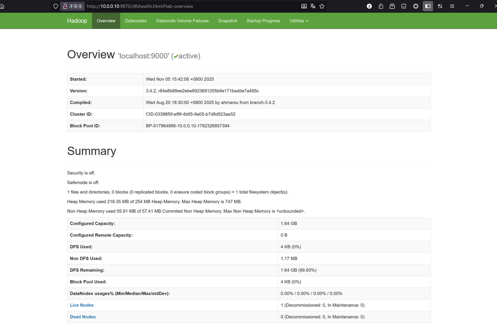
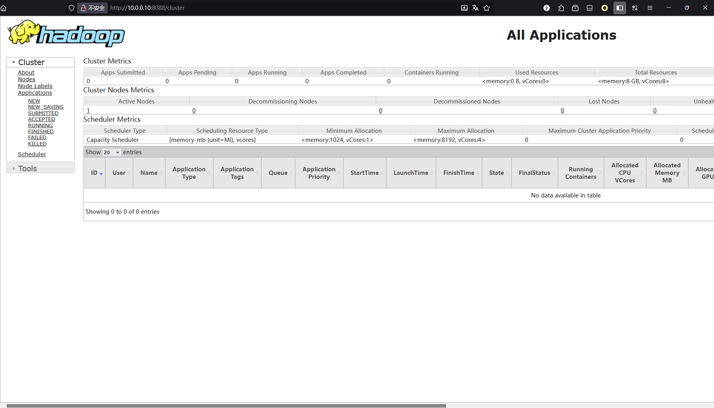
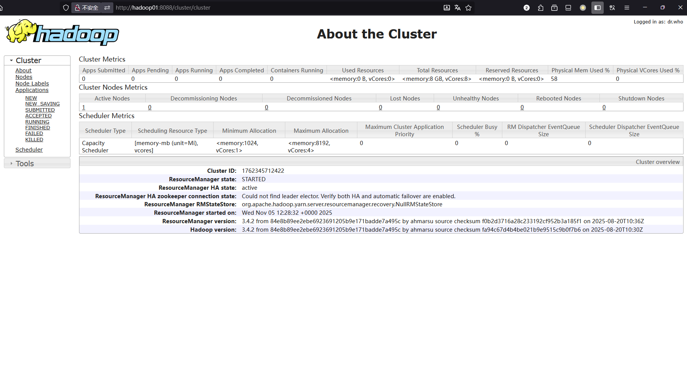

> 本文使用ubuntu25.04系统基于`java version "1.8.0_161"`和`Hadoop 3.4.2`环境展开


hadoop基于java开发，需要先安装java环境，这里采用jdk-8u161，所需文件准备链接如下：

JDK下载链接：https://download.oracle.com/otn/java/jdk/8u161-b12/2f38c3b165be4555a1fa6e98c45e0808/jdk-8u161-linux-x64.tar.gz

Hadoop下载链接：https://dlcdn.apache.org/hadoop/common/hadoop-3.4.2/hadoop-3.4.2.tar.gz


## 单节点部署

```bash
root@hadoop01:/opt# ls
hadoop-3.4.2.tar.gz  jdk-8u161-linux-x64.tar.gz
```

### 1. 将Hadoop、JDK包解压至目录/usr/local/下

```bash
root@hadoop01:/opt# tar -zxvf hadoop-3.4.2.tar.gz -C /usr/local/
root@hadoop01:/opt# tar -zxvf jdk-8u161-linux-x64.tar.gz -C /usr/local/

cd /usr/local
root@hadoop01:/usr/local# ll
total 52
drwxr-xr-x 13 root root 4096 Oct 15 08:25 ./
drwxr-xr-x 12 root root 4096 Apr 15  2025 ../
drwxr-xr-x  2 root root 4096 Apr 15  2025 bin/
drwxr-xr-x  2 root root 4096 Apr 15  2025 etc/
drwxr-xr-x  2 root root 4096 Apr 15  2025 games/
drwxr-xr-x 10 1001 1001 4096 Aug 20 11:13 hadoop-3.4.2/
drwxr-xr-x  2 root root 4096 Apr 15  2025 include/
drwxr-xr-x  8 uucp  143 4096 Dec 20  2017 jdk1.8.0_161/
drwxr-xr-x  3 root root 4096 Apr 15  2025 lib/
drwxr-xr-x  2 root root 4096 Apr 15  2025 libexec/
lrwxrwxrwx  1 root root    9 Apr 15  2025 man -> share/man/
drwxr-xr-x  2 root root 4096 Apr 15  2025 sbin/
drwxr-xr-x  6 root root 4096 Apr 15  2025 share/
drwxr-xr-x  2 root root 4096 Apr 15  2025 src/
```

### 2. 编辑/etc/profile文件

加入JDK、Hadoop所需的环境变量参数

```bash
root@hadoop01:/usr/local# tail -8 /etc/profile
export JAVA_HOME=/usr/local/jdk1.8.0_161
export CLASSPATH=$JAVA_HOME/jre/lib/ext:$JAVA_HOME/lib/tools.jar
export PATH=$JAVA_HOME/bin:$PATH

export HADOOP_HOME=/usr/local/hadoop-3.4.2
export PATH=$HADOOP_HOME/bin:$HADOOP_HOME/sbin:$PATH
export HADOOP_COMMON_LIB_NATIVE_DIR=$HADOOP_HOME/lib/native
export HADOOP_OPTS="-Djava.library.path=$HADOOP_HOME/lib:$HADOOP_COMMON_LIB_NATIVE_DIR"
```

### 3. 加载/etc/profile文件

```bash
root@hadoop01:~# source /etc/profile
```

### 4. 验证java版本

```bash
root@hadoop01:~# java -version
java version "1.8.0_161"
Java(TM) SE Runtime Environment (build 1.8.0_161-b12)
Java HotSpot(TM) 64-Bit Server VM (build 25.161-b12, mixed mode)
```

### 5. 验证hadoop版本

```bash
root@hadoop01:~# hadoop version
Hadoop 3.4.2
Source code repository https://github.com/apache/hadoop.git -r 84e8b89ee2ebe6923691205b9e171badde7a495c
Compiled by ahmarsu on 2025-08-20T10:30Z
Compiled on platform linux-x86_64
Compiled with protoc 3.23.4
From source with checksum fa94c67d4b4be021b9e9515c9b0f7b6
This command was run using /usr/local/hadoop-3.4.2/share/hadoop/common/hadoop-common-3.4.2.jar
```

###  6. MapReduce测试

**使用`hadoop-mapreduce-examples-3.4.2.jar`进行测试**

将`hadoop-mapreduce-examples-3.4.2.jar`移至/root/目录下，方便操作

```bash
root@hadoop01:~# cd /usr/local/hadoop-3.4.2/share/hadoop/mapreduce/
root@hadoop01:/usr/local/hadoop-3.4.2/share/hadoop/mapreduce# cp hadoop-mapreduce-examples-3.4.2.jar ~
```

回到/root/目录下创建input目录，并将对应文件复制进去

```bash
cd 
mkdir input
cp /usr/local/hadoop-3.4.2/etc/hadoop/*.xml /root/input
```

测试

```bash
root@hadoop01:~# hadoop jar hadoop-mapreduce-examples-3.4.2.jar wordcount ~/input/ ~/ouput
root@hadoop01:~# cat ouput/*
```

> **注意：**
>
> 如果在使用命令`hadoop jar hadoop-mapreduce-examples-3.4.2.jar wordcount ~/input/ ~/ouput`时，出现以下报错信息：
>
> ```bash
> root@hadoop01:~# hadoop jar hadoop-mapreduce-examples-3.4.2.jar wordcount ~/input/ ~/ouput
> library initialization failed - unable to allocate file descriptor table - out of memoryAborted (core dumped)
> ```
>
> 这是因为**文件描述符限制**或者**内存≤1G**
>
> 内存方面自然是加大就行，另一方面问题则采用下列方案
>
> **临时增加 fd 限制**（方便测试）
>
> ```bash
> ulimit -n 65536
> ```
>
> **永久更改fd限制**
>
> 编辑 `/etc/security/limits.conf`
>
> ```bash
> * soft nofile 65536
> * hard nofile 65536
> root soft nofile 65536
> root hard nofile 65536
> ```
>
> 在 ~/.bashrc 添加 ulimit -n 65536，然后 source ~/.bashrc即可


## 伪分布式部署

使用伪分布式Hadoop提供了完整的组件，更利于学习完整的**HDFS**（存储层）操作

**基础配置：需要执行单机部署过程中的1~5步，此处省略**


### 1. 修改配置文件

进入`etc/hadoop/`目录

本文示例的绝对路径为 `/usr/local/hadoop-3.4.2/etc/hadoop/`

```bash
root@hadoop01:~# cd /usr/local/hadoop-3.4.2/etc/hadoop/
```

编辑`etc/hadoop/core-site.xml`文件：

```xml
<configuration>
    <property>
        <name>fs.defaultFS</name>
        <value>hdfs://localhost:9000</value>
    </property>
</configuration>
```

编辑`etc/hadoop/hdfs-site.xml：`文件：

```xml
<configuration>
    <property>
        <name>dfs.replication</name>
        <value>1</value>
    </property>
</configuration>
```

### 2. 设置ssh免密

先检查是否可以在没有密码的情况下通过 ssh 连接到本地主机，因为后续在执行脚本时需要：

```bash
ssh localhost
```

如果您无法在没有密码的情况下通过 ssh 连接到本地主机，请执行以下命令：

```bash
ssh-keygen -t rsa -P '' -f ~/.ssh/id_rsa
cat ~/.ssh/id_rsa.pub >> ~/.ssh/authorized_keys
chmod 0600 ~/.ssh/authorized_keys
```

测试无密码连接主机

```bash
root@hadoop01:~# ssh localhost
Welcome to Ubuntu 25.04 (GNU/Linux 6.14.0-32-generic x86_64)

 * Documentation:  https://help.ubuntu.com
 * Management:     https://landscape.canonical.com
 * Support:        https://ubuntu.com/pro

This system has been minimized by removing packages and content that are
not required on a system that users do not log into.

To restore this content, you can run the 'unminimize' command.
Last login: Wed Oct 15 09:18:38 2025 from 127.0.0.1
root@hadoop01:~#
```


### 错误：以root执行启动！！！

**格式化文件系统**

在目录`/usr/local/hadoop-3.4.2`中

```bash
bin/hdfs namenode -format
```

**注意：**如果在执行该命令时，报错如下的话，是因为fd缘故，按照上面的方式就行

```bash
root@hadoop01:/usr/local/hadoop-3.4.2# bin/hdfs namenode -format
WARNING: /usr/local/hadoop-3.4.2/logs does not exist. Creating.
library initialization failed - unable to allocate file descriptor table - out of memoryAborted (core dumped)
```

执行结果

```bash
2025-11-05 06:52:01,811 INFO namenode.NameNode: SHUTDOWN_MSG:
/************************************************************
SHUTDOWN_MSG: Shutting down NameNode at hadoop01/10.0.0.10
************************************************************/
```

**启动 NameNode 守护进程和 DataNode 守护进程**

```bash
root@hadoop01:/usr/local/hadoop-3.4.2# sbin/start-dfs.sh
Starting namenodes on [localhost]
ERROR: Attempting to operate on hdfs namenode as root
ERROR: but there is no HDFS_NAMENODE_USER defined. Aborting operation.
Starting datanodes
ERROR: Attempting to operate on hdfs datanode as root
ERROR: but there is no HDFS_DATANODE_USER defined. Aborting operation.
Starting secondary namenodes [hadoop01]
ERROR: Attempting to operate on hdfs secondarynamenode as root
ERROR: but there is no HDFS_SECONDARYNAMENODE_USER defined. Aborting operation.
2025-11-05 07:00:22,984 WARN util.NativeCodeLoader: Unable to load native-hadoop library for your platform... using builtin-java classes where applicable

```

上列报错信息是因为从 Hadoop 3 开始，出于安全考虑，**默认禁止使用 root 用户来启动守护进程（daemons）**，比如 NameNode, DataNode 等。这是为了防止因 Hadoop 服务的潜在漏洞而导致整个系统被 root 权限攻破。

启动脚本在执行时会检查当前用户。如果发现是 root 用户，它会进一步检查是否有名为 HDFS_NAMENODE_USER、HDFS_DATANODE_USER 等环境变量来显式地授权 root 用户。如果这些变量没有被定义，脚本就会出于安全原因而失败。


### 3.创建专用的用户`hadoop`来执行

如果之前使用root用户进行过格式化文件系统的操作，将之前的格式化文件系统文件删除掉

```bash
cd /tmp
root@hadoop01:/tmp# rm -rf /tmp/hadoop-root
root@hadoop01:/tmp# rm -rf hadoop-root-namenode.pid
root@hadoop01:/tmp# rm -rf hsperfdata_root/
```

创建用户`hadoop`，并授权免密sudo

```bash
root@hadoop01:~# useradd -m -s /bin/bash hadoop
root@hadoop01:~# passwd hadoop
New password:
Retype new password:
passwd: password updated successfully

# 将hadoop加入sudo组
root@hadoop01:~# usermod -aG sudo hadoop

# 使用visudo在目录/etc/sudoers.d下创建一个单独的sudo管理文件，便于日后管理
root@hadoop01:~# visudo -f /etc/sudoers.d/hadoop
hadoop ALL=(ALL) NOPASSWD:ALL

# 授权文件权限给hadoop
root@hadoop01:~# chown -R hadoop:hadoop /usr/local/hadoop-3.4.2/

# 切换hadoop用户
root@hadoop01:~# su hadoop
hadoop@hadoop01:/usr/local/hadoop-3.4.2$
```


将JAVA_HOME环境变量写入hadoop-env.sh文件

```diff
hadoop@hadoop01:/usr/local/hadoop-3.4.2$ echo $JAVA_HOME
/usr/local/jdk1.8.0_161

hadoop@hadoop01:/usr/local/hadoop-3.4.2$ cat etc/hadoop/hadoop-env.sh | grep JAVA_HOME
#  JAVA_HOME=/usr/java/testing hdfs dfs -ls
# Technically, the only required environment variable is JAVA_HOME.
- export JAVA_HOME=
+ export JAVA_HOME=/usr/local/jdk1.8.0_161
```

### 4. 格式化文件系统

```bash
bin/hdfs namenode -format
```

进入/tmp目录查看相关文件

```bash
hadoop@hadoop01:/tmp$ ls
hadoop-hadoop	# Hadoop 临时数据存储目录
hadoop-hadoop-datanode.pid	# DataNode 进程ID
hadoop-hadoop-namenode.pid	# NameNode 进程ID  
hadoop-hadoop-secondarynamenode.pid	# SecondaryNameNode 进程ID
hsperfdata_hadoop	# Hadoop 用户的 JVM 性能数据
jetty-0_0_0_0-9868-secondary-_-any-8614851360963454836	# SecondaryNameNode Web UI
jetty-0_0_0_0-9870-hdfs-_-any-8489763191723846704	# NameNode Web UI (9870端口)
jetty-localhost-42613-datanode-_-any-325038615403139056	# DataNode Web UI

# 以下三个与hadoop无关
snap-private-tmp	# Snap 包管理的临时目录
systemd-private-839f478f22b34a5d8d54245a1d51d726-polkit.service-P1E20j	# systemd 服务的私有临时目录
systemd-private-839f478f22b34a5d8d54245a1d51d726-systemd-logind.service-42KBEb	# 登录服务的私有临时目录
```

### 5. 使用start-dfs.sh脚本启动

```bash
hadoop@hadoop01:/usr/local/hadoop-3.4.2$ sbin/start-dfs.sh
Starting namenodes on [localhost]
Starting datanodes
Starting secondary namenodes [hadoop01]
2025-11-05 07:42:13,602 WARN util.NativeCodeLoader: Unable to load native-hadoop library for your platform... using builtin-java classes where applicable
```

**Hadoop的日志位置**

`hadoop` 守护程序日志输出将写入 `HADOOP_LOG_DIR` 目录（默认为 $HADOOP_HOME/logs）。

```bash
hadoop@hadoop01:/usr/local/hadoop-3.4.2$ ls
LICENSE-binary  NOTICE-binary  README.txt  etc      lib      licenses-binary  sbin
LICENSE.txt     NOTICE.txt     bin         include  libexec  logs             share
hadoop@hadoop01:/usr/local/hadoop-3.4.2$ pwd
/usr/local/hadoop-3.4.2
hadoop@hadoop01:/usr/local/hadoop-3.4.2$ ls logs/
SecurityAuth-hadoop.audit            hadoop-hadoop-namenode-hadoop01.log
SecurityAuth-root.audit              hadoop-hadoop-namenode-hadoop01.out
hadoop-hadoop-datanode-hadoop01.log  hadoop-hadoop-secondarynamenode-hadoop01.log
hadoop-hadoop-datanode-hadoop01.out  hadoop-hadoop-secondarynamenode-hadoop01.out
```

查看进程

使用jps查看java进程；可以看到此时单机运行完整的HDFS，即伪分布hadoop成功

```bash
hadoop@hadoop01:/usr/local/hadoop-3.4.2$ jps
4100 SecondaryNameNode 
4216 Jps
3896 DataNode
3790 NameNode
```

HDFS（存储层）

**NameNode:** HDFS主节点，管理文件系统命名空间、元数据、数据块映射

**DataNode:** HDFS从节点，存储实际数据块、执行数据读写操作

**SecondaryNameNode:** HDFS辅助节点，定期合并编辑日志、防止NameNode过载


### dashboard

可以通过http://localhost:9870进入web界面



### 6. 制作执行 MapReduce 作业所需的 HDFS 目录

这里username可以自己起一个

```bash
bin/hdfs dfs -mkdir -p /user/<username>
```

例如我现在创建一个hadoop的

```bash
hadoop@hadoop01:/usr/local/hadoop-3.4.2$ bin/hdfs dfs -mkdir -p /user/hadoop
```

改文件目录不在虚拟机中的真实目录/user中，

通过命令`bin/hdfs dfs -ls <dir>` 查询

```bash
hadoop@hadoop01:/usr/local/hadoop-3.4.2$ bin/hdfs dfs -ls /
2025-11-05 08:09:32,575 WARN util.NativeCodeLoader: Unable to load native-hadoop library for your platform... using builtin-java classes where applicable
Found 1 items
drwxr-xr-x   - hadoop supergroup          0 2025-11-05 08:07 /user
hadoop@hadoop01:/usr/local/hadoop-3.4.2$ bin/hdfs dfs -ls /user
2025-11-05 08:09:37,137 WARN util.NativeCodeLoader: Unable to load native-hadoop library for your platform... using builtin-java classes where applicable
Found 1 items
drwxr-xr-x   - hadoop supergroup          0 2025-11-05 08:07 /user/hadoop
```


### 伪分布方式部署——断电恢复

由于之前的伪分布式部署方式中，所有的文件都在系统的/tmp目录中，当机器重启后，作为linux系统中**临时目录**的/tmp，将会**丢失**之前的数据。直接使用命令`sbin/start-dfs.sh`启动的话，不会报错，但是`NameNode`将不会被启动。

```bash
$ jps
1941 SecondaryNameNode
1781 DataNode
2058 Jps
```


#### 方法一：重新格式化、快速恢复

快速恢复需要删除之前在/tmp的所有hadoop的pid文件，再去重新格式化文件系统，去启动

```bash
# 1. 停止所有 Hadoop 服务
sbin/stop-dfs.sh

# 2. 删除所有残留的 PID 文件
rm -f /tmp/hadoop-hadoop-*.pid

# 3. 重新格式化 NameNode
bin/hdfs namenode -format

# 4. 重新启动 Hadoop
sbin/start-dfs.sh

# 5. 验证启动状态
$ jps
2834 DataNode
2963 SecondaryNameNode
2740 NameNode
3319 Jps
```

由于重新格式化了文件系统，所以之前所创建的HDFS目录也不存在了，需要重新创建

```bash
hadoop@hadoop01:/usr/local/hadoop-3.4.2$ bin/hdfs dfs -mkdir -p /user/hadoop
hadoop@hadoop01:/usr/local/hadoop-3.4.2$ bin/hdfs dfs -ls /user/
Found 1 items
drwxr-xr-x   - hadoop supergroup          0 2025-11-05 08:58 /user/hadoop
```


#### 方法二：更改hadoop为持久化存储

为了避免这个问题再次发生，建议将 Hadoop 数据目录从 **临时目录**`/tmp` 改为**持久化目录**

```bash
# 1. 停止 Hadoop 服务
hadoop@hadoop01:/usr/local/hadoop-3.4.2$ sbin/stop-dfs.sh
Stopping namenodes on [localhost]
Stopping datanodes
Stopping secondary namenodes [hadoop01]

# 2. 创建持久化数据目录
sudo mkdir -p /var/hadoop/data
sudo chown -R hadoop:hadoop /var/hadoop

# 3. 修改 core-site.xml
vim etc/hadoop/core-site.xml
```

##### 在 `core-site.xml` 中添加：

```xml
<property>
    <name>hadoop.tmp.dir</name>
    <value>/var/hadoop/data</value>
</property>
```

添加完成后的文件内容，具体如下

```xml
<configuration>
    <property>
        <name>fs.defaultFS</name>
        <value>hdfs://localhost:9000</value>
    </property>
    <property>
        <name>hadoop.tmp.dir</name>
        <value>/var/hadoop/data</value>
    </property>
</configuration>
```

##### 在`hdfs-site.xml`中添加：

```xml
<property>
    <name>dfs.namenode.name.dir</name>
    <value>file://${hadoop.tmp.dir}/dfs/name</value>
</property>
<property>
    <name>dfs.datanode.data.dir</name>
    <value>file://${hadoop.tmp.dir}/dfs/data</value>
</property>
```

添加完成后的文件内容，具体如下

```xml
<configuration>
    <property>
        <name>dfs.replication</name>
        <value>1</value>
    </property>
    <property>
        <name>dfs.namenode.name.dir</name>
        <value>file://${hadoop.tmp.dir}/dfs/name</value>
    </property>
    <property>
        <name>dfs.datanode.data.dir</name>
        <value>file://${hadoop.tmp.dir}/dfs/data</value>
    </property>
</configuration>
```

##### 重新格式化并启动

```bash
bin/hdfs namenode -format
sbin/start-dfs.sh
```

使用JPS验证进程

```bash
$ jps
5217 DataNode
5077 NameNode
5500 Jps
5390 SecondaryNameNode
```

查看持久化目录

```bash
hadoop@hadoop01:/usr/local/hadoop-3.4.2$ ls /var/hadoop/data/
dfs
hadoop@hadoop01:/usr/local/hadoop-3.4.2$ ls /var/hadoop/data/dfs/
data  name  namesecondary
```

格式化后会丢失所有 HDFS 数据，需要重新创建：

```bash
hadoop@hadoop01:/usr/local/hadoop-3.4.2$ bin/hdfs dfs -mkdir -p /user/hadoop
hadoop@hadoop01:/usr/local/hadoop-3.4.2$ bin/hdfs dfs -ls /user
Found 1 items
drwxr-xr-x   - hadoop supergroup          0 2025-11-05 09:31 /user/hadoop
```


#### MapReduce测试

创建目录和测试数据，将输入文件复制到分布式文件系统中：

```bash
$ bin/hdfs dfs -mkdir input
$ bin/hdfs dfs -put etc/hadoop/*.xml input/
$ bin/hdfs dfs -ls /user/hadoop/input
Found 10 items
-rw-r--r--   1 hadoop supergroup       9213 2025-11-05 09:32 /user/hadoop/input/capacity-scheduler.xml
-rw-r--r--   1 hadoop supergroup        991 2025-11-05 09:32 /user/hadoop/input/core-site.xml
-rw-r--r--   1 hadoop supergroup      14007 2025-11-05 09:32 /user/hadoop/input/hadoop-policy.xml
-rw-r--r--   1 hadoop supergroup        683 2025-11-05 09:32 /user/hadoop/input/hdfs-rbf-site.xml
-rw-r--r--   1 hadoop supergroup       1129 2025-11-05 09:32 /user/hadoop/input/hdfs-site.xml
-rw-r--r--   1 hadoop supergroup        620 2025-11-05 09:32 /user/hadoop/input/httpfs-site.xml
-rw-r--r--   1 hadoop supergroup       3518 2025-11-05 09:32 /user/hadoop/input/kms-acls.xml
-rw-r--r--   1 hadoop supergroup        682 2025-11-05 09:32 /user/hadoop/input/kms-site.xml
-rw-r--r--   1 hadoop supergroup        758 2025-11-05 09:32 /user/hadoop/input/mapred-site.xml
-rw-r--r--   1 hadoop supergroup        690 2025-11-05 09:32 /user/hadoop/input/yarn-site.xml
```

运行hadoop提供的示例，

```bash
hadoop@hadoop01:/usr/local/hadoop-3.4.2$ bin/hadoop jar share/hadoop/mapreduce/hadoop-mapreduce-examples-3.4.2.jar grep input output 'dfs[a-z.]+'
```

这个Hadoop命令是在运行一个**分布式grep搜索任务**，具体功能如下：

**各组成部分**：

- **`hadoop jar`**：运行Hadoop MapReduce作业
- **`hadoop-mapreduce-examples-3.4.2.jar`**：Hadoop自带的示例程序包
- **`grep`**：选择运行grep示例程序
- **`input`**：HDFS输入目录路径
- **`output`**：HDFS输出目录路径
- **`'dfs[a-z.]+'`**：要搜索的正则表达式模式

**正则表达式含义**

`'dfs[a-z.]+'` 表示：

- **`dfs`**：匹配字母 "dfs"
- **`[a-z.]+`**：匹配一个或多个小写字母或点号
- **整体效果**：查找以 "dfs" 开头，后跟小写字母或点号的单词

查看分布式文件系统上的输出文件：

```bash
hadoop@hadoop01:/usr/local/hadoop-3.4.2$ bin/hdfs dfs -cat /user/hadoop/output/*
1	dfsadmin
1	dfs.replication
1	dfs.namenode.name.dir
1	dfs.datanode.data.dir
```

也可以，将输出文件从分布式文件系统复制到本地文件系统并检查它们：

```bash
bin/hdfs dfs -get output output
cat output/*
```

执行完后，停止守护进程

```bash
hadoop@hadoop01:/usr/local/hadoop-3.4.2$  sbin/stop-dfs.sh
Stopping namenodes on [localhost]
Stopping datanodes
Stopping secondary namenodes [hadoop01]
hadoop@hadoop01:/usr/local/hadoop-3.4.2$ jps
6403 Jps
```


### 伪分布式部署——YRAN

您可以通过设置一些参数并另外运行 ResourceManager 守护程序和 NodeManager 守护程序，以伪分布式模式在 YARN 上运行 MapReduce 作业。

**YARN的优势**

1. **资源利用率高**：多个应用共享集群资源
2. **扩展性强**：轻松添加新节点
3. **多租户支持**：多个用户/应用同时运行
4. **容错性好**：任务失败自动重启
5. **监控完善**：通过Web UI实时监控

以下指令建立在前面启动了HDFS守护进程以及创建了执行MapReduce作业所需的HDFS目录的基础上

即执行了下面三条指令

```bash
# 1. 格式化文件系统
bin/hdfs namenode -format

# 2. 启动NameNode守护进程和DataNode守护进程
sbin/start-dfs.sh

# 3. 制作执行 MapReduce 作业所需的 HDFS 目录
 bin/hdfs dfs -mkdir -p /user/hadoop
```

#### 修改配置文件

##### `etc/hadoop/mapred-site.xml`

```xml
<configuration>
    <property>
        <name>mapreduce.framework.name</name>
        <value>yarn</value>
    </property>
    <property>
        <name>mapreduce.application.classpath</name>
        <value>$HADOOP_MAPRED_HOME/share/hadoop/mapreduce/*:$HADOOP_MAPRED_HOME/share/hadoop/mapreduce/lib/*</value>
    </property>
</configuration>
```

##### `etc/hadoop/yarn-site.xml`

```xml
<configuration>
    <property>
        <name>yarn.nodemanager.aux-services</name>
        <value>mapreduce_shuffle</value>
    </property>
    <property>
        <name>yarn.nodemanager.env-whitelist</name>
        <value>JAVA_HOME,HADOOP_COMMON_HOME,HADOOP_HDFS_HOME,HADOOP_CONF_DIR,CLASSPATH_PREPEND_DISTCACHE,HADOOP_YARN_HOME,HADOOP_HOME,PATH,LANG,TZ,HADOOP_MAPRED_HOME</value>
    </property>
</configuration>
```

### YARN使用持久化存储

如果不使用/tmp目录，需要定义持久化存储目录的话，可在`yarn-site.xml`中**添加**以下内容

```xml
<!-- 目录优化配置 -->
    <property>
        <name>yarn.nodemanager.local-dirs</name>
        <value>file:///var/hadoop/data/nm-local-dir</value>
    </property>
    <property>
        <name>yarn.nodemanager.log-dirs</name>
        <value>file:///var/hadoop/data/user-logs</value>
    </property>
    <property>
        <name>yarn.resourcemanager.fs.state-store.uri</name>
        <value>file:///var/hadoop/data/resourcemanager</value>
    </property>
```


具体修改步骤如下

**使用sed命令直接进行修改配置**

```bash
# 备份原文件
cp etc/hadoop/yarn-site.xml etc/hadoop/yarn-site.xml.backup

# 使用sed在</configuration>前插入配置
sed -i '/<\/configuration>/i\
    <!-- 目录优化配置 -->\
    <property>\
        <name>yarn.nodemanager.local-dirs</name>\
        <value>file:///var/hadoop/data/nm-local-dir</value>\
    </property>\
    <property>\
        <name>yarn.nodemanager.log-dirs</name>\
        <value>file:///var/hadoop/data/user-logs</value>\
    </property>\
    <property>\
        <name>yarn.resourcemanager.fs.state-store.uri</name>\
        <value>file:///var/hadoop/data/resourcemanager</value>\
    </property>' etc/hadoop/yarn-site.xml
```

最终配置详情

```xml
<configuration>
    <property>
        <name>yarn.nodemanager.aux-services</name>
        <value>mapreduce_shuffle</value>
    </property>
    <property>
        <name>yarn.nodemanager.env-whitelist</name>
        <value>JAVA_HOME,HADOOP_COMMON_HOME,HADOOP_HDFS_HOME,HADOOP_CONF_DIR,CLASSPATH_PREPEND_DISTCACHE,HADOOP_YARN_HOME,HADOOP_HOME,PATH,LANG,TZ,HADOOP_MAPRED_HOME</value>
    </property>
    <!-- 目录优化配置 -->
    <property>
        <name>yarn.nodemanager.local-dirs</name>
        <value>file:///var/hadoop/data/nm-local-dir</value>
    </property>
    <property>
        <name>yarn.nodemanager.log-dirs</name>
        <value>file:///var/hadoop/data/user-logs</value>
    </property>
    <property>
        <name>yarn.resourcemanager.fs.state-store.uri</name>
        <value>file:///var/hadoop/data/resourcemanager</value>
    </property>
</configuration>
```

**创建对应目录**

```bash
mkdir -p /var/hadoop/data/user-logs
mkdir -p /var/hadoop/data/resourcemanager
```

**重启YARN服务**

```bash
sbin/stop-yarn.sh
sbin/start-yarn.sh
```


#### 启动YARN

启动 ResourceManager 守护程序和 NodeManager 守护程序

```bash
$ sbin/start-yarn.sh
Starting resourcemanager
Starting nodemanagers

$ jps
1904 ResourceManager
1488 DataNode
1378 NameNode
2339 Jps
1699 SecondaryNameNode
2004 NodeManager
```

- **HDFS三进程** = 分布式存储能力
- **HDFS三进程 + YARN两进程** = 分布式存储 + 分布式计算能力

HDFS（存储层）

**NameNode:** HDFS主节点，管理文件系统命名空间、元数据、数据块映射

**DataNode:** HDFS从节点，存储实际数据块、执行数据读写操作

**SecondaryNameNode:** HDFS辅助节点，定期合并编辑日志、防止NameNode过载


YARN组件（计算层）

**ResourceManager:** YARN主节点，全局资源调度、应用管理、节点监控

**ResourceManager**: YARN从节点，单个节点资源管理、容器启动、任务监控


**此容器（YARN）非彼容器（Docker）**：YARN容器是基于JVM进程，使用Linux Cgroups进行资源限制，主要运行MapReduce任务。

**YARN容器的创建过程**

```bash
1. Client提交作业 → ResourceManager
2. ResourceManager分配容器 → NodeManager  
3. NodeManager启动Container Launcher
4. 创建cgroup资源限制
5. 启动独立的JVM进程
6. 执行MapTask/ReduceTask
```

**资源限制实现**

YARN使用Linux cgroups进行资源控制

```bash
/sys/fs/cgroup/cpu/yarn/
/sys/fs/cgroup/memory/yarn/
```


#### 进入web界面

检测是否启动了8088端口

```bash
$ ss -ntpl | grep 8088
LISTEN 0      500                *:8088             *:*    users:(("java",pid=1904,fd=370))
```

使用浏览器输入http://localhost:8088进入




#### MapReduce测试

使用MapReduce进行测试

```bash
$ bin/hadoop jar share/hadoop/mapreduce/hadoop-mapreduce-examples'dfs[a-z.]+'
```

使用该示例，样本过小，可能区别不大。但与使用本地模式对比，YARN更适合生产环境，处理大数据量的场景


### YARN相关操作


#### **查看YARN容器**


查看运行的YARN容器进程

```bash
ps aux | grep yarn | grep -v grep
```

查看具体的MapReduce任务进程

```bash
ps aux | grep java | grep -E "(MapTask|ReduceTask)"
```


#### **YARN容器资源监控**


通过YARN Web UI查看容器资源使用：http://localhost:8088/cluster/apps




或者使用YARN命令


##### 实时监控：`yarn top`

```bash
$ yarn top
```

具体显示如下，**YARN top显示的是实时运行的任务**，当前没有运行任何任务，所以没有数据

```bash
YARN top - 14:16:43, up 0d, 1:48, 0 active users, queue(s): root
NodeManager(s): 1 total, 1 active, 0 unhealthy, 0 decommissioning, 0 decommissioned, 0 lost, 0 reboote
Queue(s) Applications: 0 running, 0 submitted, 0 pending, 0 completed, 0 killed, 0 failed
Queue(s) Mem(GB): 8 available, 0 allocated, 0 pending, 0 reserved
Queue(s) VCores: 8 available, 0 allocated, 0 pending, 0 reserved
Queue(s) Containers: 0 allocated, 0 pending, 0 reserved

                  APPLICATIONID USER             TYPE      QUEUE PRIOR   #CONT  #RCONT  VCORES RVCORES
```

提示：如果想看到数据，可以使用MapReduce的测试示例，但由于样本太小，显示的数据也有限

比如使用`hadoop jar share/hadoop/mapreduce/hadoop-mapreduce-examples-3.4.2.jar grep input output 'dfs[a-z.]+'`测试，`yarn top`输出信息如下

```bash
YARN top - 14:31:07, up 0d, 2:2, 1 active users, queue(s): root
NodeManager(s): 1 total, 1 active, 0 unhealthy, 0 decommissioning, 0 decommissioned, 0 lost, 0 reboote
Queue(s) Applications: 1 running, 2 submitted, 0 pending, 1 completed, 0 killed, 0 failed
Queue(s) Mem(GB): 0 available, 8 allocated, 4 pending, 0 reserved
Queue(s) VCores: 0 available, 7 allocated, 4 pending, 0 reserved
Queue(s) Containers: 7 allocated, 4 pending, 0 reserved

                  APPLICATIONID USER             TYPE      QUEUE PRIOR   #CONT  #RCONT  VCORES RVCORES
 application_1762345712422_0002 hadoop      mapreduce root.default     0       7       0       7
```


##### **输出信息解析如下**

**集群概览：**

```bash
YARN top - 14:16:43, up 0d, 1:48, 0 active users, queue(s): root
```

| 参数               | 含义                             |
| ------------------ | -------------------------------- |
| **14:16:43**       | 当前系统时间                     |
| **up 0d, 1:48**    | YARN运行时间（0天1小时48分）     |
| **0 active users** | 当前活跃用户数（提交作业的用户） |
| **queue(s): root** | 可用的资源队列（只有root队列）   |


**NodeManager状态：**

```bash
NodeManager(s): 1 total, 1 active, 0 unhealthy, 0 decommissioning, 0 decommissioned, 0 lost, 0 reboote
```

| 参数                  | 含义                                  |
| --------------------- | ------------------------------------- |
| **1 total**           | 集群中NodeManager总数                 |
| **1 active**          | 正常工作的NodeManager数量             |
| **0 unhealthy**       | 不健康的NodeManager（资源不足等）     |
| **0 decommissioning** | 正在退役的NodeManager（优雅下线中）   |
| **0 decommissioned**  | 已退役的NodeManager（不再接收新任务） |
| **0 lost**            | 丢失的NodeManager（网络中断等）       |
| **0 rebooted**        | 重启中的NodeManager                   |


**资源使用情况**

应用队列状态

```bash
Queue(s) Applications: 0 running, 0 submitted, 0 pending, 0 completed, 0 killed, 0 failed
```

| 参数            | 含义                             |
| --------------- | -------------------------------- |
| **0 running**   | 当前正在运行的应用数量           |
| **0 submitted** | 已提交等待调度的应用数量         |
| **0 pending**   | 等待资源分配的应用数量           |
| **0 completed** | 已完成的应用程序数量（本次会话） |
| **0 killed**    | 被手动终止的应用数量             |
| **0 failed**    | 运行失败的应用数量               |


运行作业时的`yarn top`参数解释：

```bash
APPLICATIONID USER             TYPE      QUEUE PRIOR   #CONT  #RCONT  VCORES RVCORES
```

| 列名              | 含义                          |
| ----------------- | ----------------------------- |
| **APPLICATIONID** | 应用唯一ID                    |
| **USER**          | 提交作业的用户                |
| **TYPE**          | 应用类型（MapReduce/Spark等） |
| **QUEUE**         | 使用的资源队列                |
| **#CONT**         | 运行的容器数量                |
| **VCORES**        | 使用的CPU核数                 |
| **MEM(GB)**       | 使用的内存大小                |


##### **yarn application**

###### 查看应用列表

`yarn application -list`

```bash
$ yarn application -list
2025-11-05 14:17:32,596 INFO client.DefaultNoHARMFailoverProxyProvider: Connecting to ResourceManager at /0.0.0.0:8032
Total number of applications (application-types: [], states: [SUBMITTED, ACCEPTED, RUNNING] and tags: []):0
                Application-Id	    Application-Name	    Application-Type	      User	     Queue	             State	       Final-State	       Progress	                       Tracking-URL
```

**只显示特定状态的应用：**

- `SUBMITTED`（已提交）
- `ACCEPTED`（已接受）
- `RUNNING`（运行中）


###### 查看所有应用（包括已完成的）

`yarn application -list -appStates ALL`

```bash
yarn application -list -appStates ALL
2025-11-05 14:34:29,392 INFO client.DefaultNoHARMFailoverProxyProvider: Connecting to ResourceManager at /0.0.0.0:8032
Total number of applications (application-types: [], states: [NEW, NEW_SAVING, SUBMITTED, ACCEPTED, RUNNING, FINISHED, FAILED, KILLED] and tags: []):2
                Application-Id	    Application-Name	    Application-Type	      User	     Queue	             State	       Final-State	       Progress	                       Tracking-URL
application_1762345712422_0002	         grep-search	           MAPREDUCE	    hadoop	root.default	          FINISHED	         SUCCEEDED	           100%	http://hadoop01:19888/jobhistory/job/job_1762345712422_0002
application_1762345712422_0001	         grep-search	           MAPREDUCE	    hadoop	root.default	          FINISHED	         SUCCEEDED	           100%	http://hadoop01:19888/jobhistory/job/job_1762345712422_0001
```

**显示所有状态的应用**，包括：

- `SUBMITTED`, `ACCEPTED`, `RUNNING`

- `FINISHED`（已完成）

- `FAILED`（失败）

- `KILLED`（被杀死）

  

###### 查看具体的失败原因

`yarn application -status <application_id>`


##### **yarn node**


##### 检查节点健康状况

`yarn node -list`：查看节点列表

```bash
$ yarn node -list
2025-11-05 14:53:52,632 INFO client.DefaultNoHARMFailoverProxyProvider: Connecting to ResourceManager at /0.0.0.0:8032
Total Nodes:1
         Node-Id	     Node-State	Node-Http-Address	Number-of-Running-Containers
  hadoop01:40753	        RUNNING	    hadoop01:8042
```

`yarn node -status`：查看某个节点状态

```bash
$ yarn node -status hadoop01:40753
2025-11-05 14:57:22,891 INFO client.DefaultNoHARMFailoverProxyProvider: Connecting to ResourceManager at /0.0.0.0:8032
2025-11-05 14:57:23,114 INFO conf.Configuration: resource-types.xml not found
2025-11-05 14:57:23,114 INFO resource.ResourceUtils: Unable to find 'resource-types.xml'.
Node Report :
	Node-Id : hadoop01:40753
	Rack : /default-rack
	Node-State : RUNNING
	Node-Http-Address : hadoop01:8042
	Last-Health-Update : Wed 05/Nov/25 02:56:33:655UTC
	Health-Report :
	Containers : 0
	Memory-Used : 0MB
	Memory-Capacity : 8192MB
	CPU-Used : 0 vcores
	CPU-Capacity : 8 vcores
	Node-Labels :
	Node Attributes :
	Resource Utilization by Node : PMem:1370 MB, VMem:2705 MB, VCores:0.0066445186
	Resource Utilization by Containers : PMem:0 MB, VMem:0 MB, VCores:0.0
```


#### 
