> 本笔记主要记录使用阿里云域名以及阿里云ECS实例创建的web服务器，利用Certbot工具去给Nginx申请证书的过程


## 先决条件

必须需要拥有一个域名，本文中使用的是阿里云中的域名进行测试

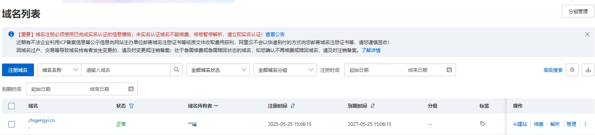

购买一台ecs实例作为我们本次测试的web服务器，具体参数可根据自身具体调整。

记得开放80与443端口！

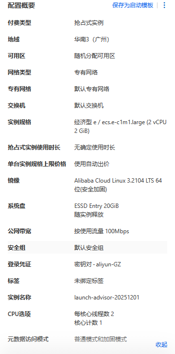

查看公网IP

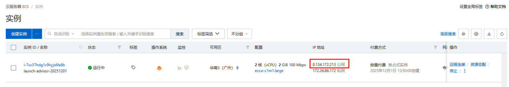

使用远程工具进行连接

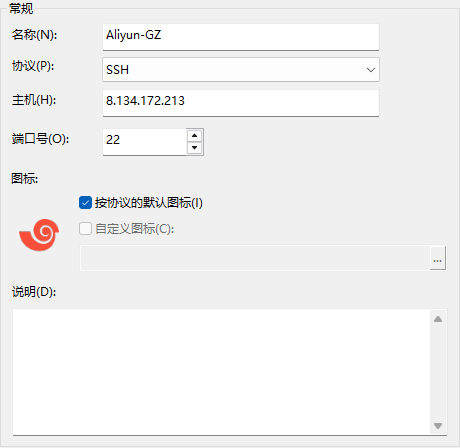

根据购买服务器时使用的连接方式进行连接

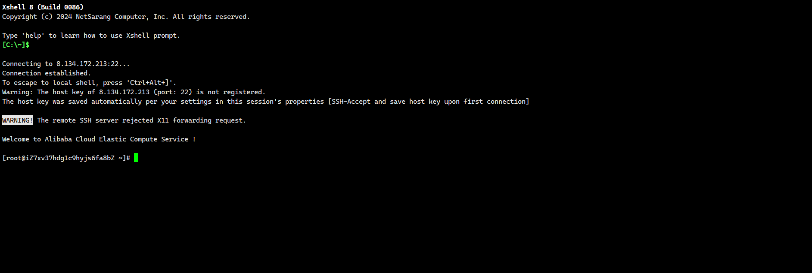

更改主机名

```bash
[root@web-nginx ~]# hostnamectl
   Static hostname: web-nginx
         Icon name: computer-vm
           Chassis: vm
        Machine ID: 289800cb8b604e6ba20ec84f5d4e1081
           Boot ID: ad4b494b4af94bbc956f4239c299c072
    Virtualization: kvm
  Operating System: Alibaba Cloud Linux 3.2104 U12 (OpenAnolis Edition)
            Kernel: Linux 5.10.134-19.1.al8.x86_64
      Architecture: x86-64
```

下载所需安装包

```bash
[root@web-nginx ~]# yum install -y nginx certbot python3-certbot-nginx
```

```bash
[root@web-nginx ~]# certbot --version
certbot 1.22.0
```

```bash
[root@web-nginx ~]# nginx -v
nginx version: nginx/1.20.1
```

启动nginx

```bash
systemctl start nginx
```

开启nginx之后，先使用IP+http的方式，去进行访问测试防火墙开放正常

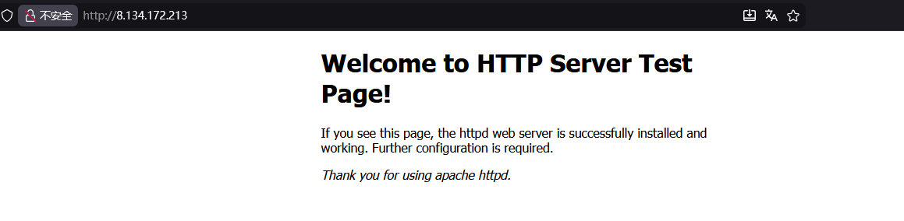


## 基础准备

在域名上对web服务器进行解析条目创建

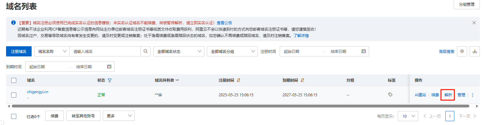

选择添加记录


具体参数如图

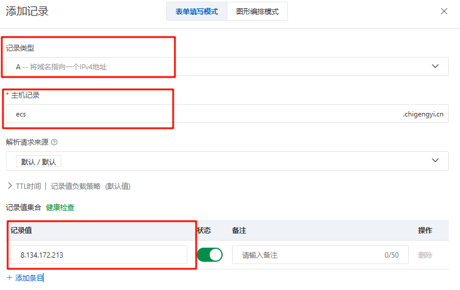

使用域名去进行访问测试

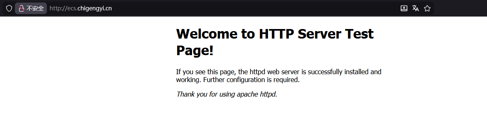


## 证书申请

使用certbot命令进行证书申请

```bash
sudo certbot --nginx
```

```bash
[root@web-nginx ~]# sudo certbot --nginx
Saving debug log to /var/log/letsencrypt/letsencrypt.log
Enter email address (used for urgent renewal and security notices)
 (Enter 'c' to cancel): 2962149672@qq.com	# 输入你的邮箱地址

- - - - - - - - - - - - - - - - - - - - - - - - - - - - - - - - - - - - - - - -
Please read the Terms of Service at
https://letsencrypt.org/documents/LE-SA-v1.6-August-18-2025.pdf. You must agree
in order to register with the ACME server. Do you agree?
- - - - - - - - - - - - - - - - - - - - - - - - - - - - - - - - - - - - - - - -
(Y)es/(N)o: y	# 填写Y

- - - - - - - - - - - - - - - - - - - - - - - - - - - - - - - - - - - - - - - -
Would you be willing, once your first certificate is successfully issued, to
share your email address with the Electronic Frontier Foundation, a founding
partner of the Let's Encrypt project and the non-profit organization that
develops Certbot? We'd like to send you email about our work encrypting the web,
EFF news, campaigns, and ways to support digital freedom.
- - - - - - - - - - - - - - - - - - - - - - - - - - - - - - - - - - - - - - - -
(Y)es/(N)o: y
Account registered.
Please enter the domain name(s) you would like on your certificate (comma and/or
space separated) (Enter 'c' to cancel): ecs.chigengyi.cn
Requesting a certificate for ecs.chigengyi.cn

Successfully received certificate.
Certificate is saved at: /etc/letsencrypt/live/ecs.chigengyi.cn/fullchain.pem
Key is saved at:         /etc/letsencrypt/live/ecs.chigengyi.cn/privkey.pem
This certificate expires on 2026-03-01.
These files will be updated when the certificate renews.
Certbot has set up a scheduled task to automatically renew this certificate in the background.

Deploying certificate
Could not install certificate

NEXT STEPS:
- The certificate was saved, but could not be installed (installer: nginx). After fixing the error shown below, try installing it again by running:
  certbot install --cert-name ecs.chigengyi.cn
```

通过查看对应目录，验证证书是否成功申请下来

```bash
[root@web-nginx ~]# ls -la /etc/letsencrypt/live/ecs.chigengyi.cn/
total 12
drwxr-xr-x 2 root root 4096 Dec  1 14:15 .
drwx------ 3 root root 4096 Dec  1 14:15 ..
lrwxrwxrwx 1 root root   40 Dec  1 14:15 cert.pem -> ../../archive/ecs.chigengyi.cn/cert1.pem
lrwxrwxrwx 1 root root   41 Dec  1 14:15 chain.pem -> ../../archive/ecs.chigengyi.cn/chain1.pem
lrwxrwxrwx 1 root root   45 Dec  1 14:15 fullchain.pem -> ../../archive/ecs.chigengyi.cn/fullchain1.pem
lrwxrwxrwx 1 root root   43 Dec  1 14:15 privkey.pem -> ../../archive/ecs.chigengyi.cn/privkey1.pem
-rw-r--r-- 1 root root  692 Dec  1 14:15 README
```


## HTTPS验证

### 已配置的conf文件测试

创建一个Nginx的子文件进行测试

```bash
vim /etc/nginx/conf.d/ecs.chigengyi.cn.conf
```

切记文件名以conf结尾，否则nginx不会将该子文件包含进主文件中，因为nginx.conf中对于该子目录的规则为`*.conf`

```bash
include /etc/nginx/conf.d/*.conf;
```

ecs.chigengyi.cn.conf文件内容

```bash
server {
    listen 80;
    server_name ecs.chigengyi.cn;	# 服务器名称，填写自己的域名
    
    # 重定向 HTTP 到 HTTPS
    return 301 https://$server_name$request_uri;
}

server {
    listen 443 ssl http2;
    server_name ecs.chigengyi.cn;	# 服务器名称，填写自己的域名
    
    # SSL 证书路径
    ssl_certificate /etc/letsencrypt/live/ecs.chigengyi.cn/fullchain.pem;
    ssl_certificate_key /etc/letsencrypt/live/ecs.chigengyi.cn/privkey.pem;
    
    # SSL 安全配置
    ssl_protocols TLSv1.2 TLSv1.3;
    ssl_ciphers ECDHE-RSA-AES256-GCM-SHA512:DHE-RSA-AES256-GCM-SHA512:ECDHE-RSA-AES256-GCM-SHA384:DHE-RSA-AES256-GCM-SHA384;
    ssl_prefer_server_ciphers off;
    ssl_session_cache shared:SSL:10m;
    ssl_session_timeout 10m;
    
    # 网站根目录（根据你的实际情况修改）
    root /usr/share/nginx/html;
    index index.html index.htm;
    
    location / {
        try_files $uri $uri/ =404;
    }
    
    # 其他配置...
}
```


检测nginx配置文件是否正确

```bash
nginx -t
```

```bash
nginx: the configuration file /etc/nginx/nginx.conf syntax is ok
nginx: configuration file /etc/nginx/nginx.conf test is successful
```


加载配置文件

```bash
nginx -s reload
```

或重启nginx服务

```bash
systemctl restart nginx
```


查看443端口是否启用

```bash
# ss -ntpl | grep "443"
LISTEN 0      511          0.0.0.0:443       0.0.0.0:*    users:(("nginx",pid=2179,fd=7),("nginx",pid=2178,fd=7),("nginx",pid=2097,fd=7))
```

使用https://ecs.chigengyi.cn访问网页测试

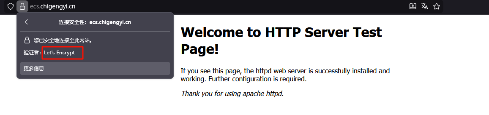

可以看到，已经成功为网站添加了使用certbot申请的Let's Encrypt证书


### 使用certbot命令去安装证书

首先我们需要有一个类似于这样的配置文件，里面包含了用于申请证书的域名等信息

```bash
server {
    listen 80;
    server_name ecs.chigengyi.cn;
    
    root /usr/share/nginx/html;
    index index.html index.htm;
    
    location / {
        try_files $uri $uri/ =404;
    }
}
```

重新加载配置

```bash
sudo nginx -t && sudo nginx -s reload
```

使用 certbot 重新配置，添加 --redirect 参数

```bash
sudo certbot --nginx -d ecs.chigengyi.cn --redirect
```

查看conf配置文件变化

```bash
cat /etc/nginx/conf.d/ecs.chigengyi.cn.conf
```

```bash
server {
    server_name ecs.chigengyi.cn;

    root /usr/share/nginx/html;
    index index.html index.htm;

    location / {
        try_files $uri $uri/ =404;
    }

    listen 443 ssl; # managed by Certbot
    ssl_certificate /etc/letsencrypt/live/ecs.chigengyi.cn/fullchain.pem; # managed by Certbot
    ssl_certificate_key /etc/letsencrypt/live/ecs.chigengyi.cn/privkey.pem; # managed by Certbot
    include /etc/letsencrypt/options-ssl-nginx.conf; # managed by Certbot
    ssl_dhparam /etc/letsencrypt/ssl-dhparams.pem; # managed by Certbot


}
server {
    if ($host = ecs.chigengyi.cn) {
        return 301 https://$host$request_uri;
    } # managed by Certbot


    listen 80;
    server_name ecs.chigengyi.cn;
    return 404; # managed by Certbot


}
```

这样也会产生效果，但在实际生产环境中，不建议使用该方法。

因为使用`certbot`命令去自生成的配置文件参数中，带有的`if`语句，会降低nginx的性能，并且自定义的配置文件，往往才更加适合自己的环境需求。


## 自动续签


openssl命令查看当前证书有效期截止日期

```bash
openssl x509 -enddate -noout -in /etc/letsencrypt/live/ecs.chigengyi.cn/fullchain.pem
```

```bash
# openssl x509 -enddate -noout -in /etc/letsencrypt/live/ecs.chigengyi.cn/fullchain.pem
notAfter=Mar  1 05:16:32 2026 GMT
```

可以看到目前的截止日期为2026.3.1


### 测试续签流程

使用`certbot renew --dry-run`命令测试续签流程，是否正常

```bash
sudo certbot renew --dry-run
```

```bash
# sudo certbot renew --dry-run
Saving debug log to /var/log/letsencrypt/letsencrypt.log

- - - - - - - - - - - - - - - - - - - - - - - - - - - - - - - - - - - - - - - -
Processing /etc/letsencrypt/renewal/ecs.chigengyi.cn.conf
- - - - - - - - - - - - - - - - - - - - - - - - - - - - - - - - - - - - - - - -
Simulating renewal of an existing certificate for ecs.chigengyi.cn

- - - - - - - - - - - - - - - - - - - - - - - - - - - - - - - - - - - - - - - -
Congratulations, all simulated renewals succeeded:
  /etc/letsencrypt/live/ecs.chigengyi.cn/fullchain.pem (success)
- - - - - - - - - - - - - - - - - - - - - - - - - - - - - - - - - - - - - - - -
```


查找certbot自动续签文件

```bash
ls -la /usr/lib/systemd/system/certbot*
```

查看`certbot-renew.timer`状态

```bash
systemctl status certbot-renew.timer
```

`certbot-renew.timer`是certbot的定时器，触发机制如下

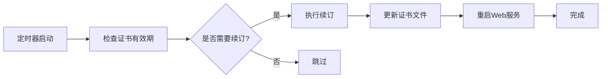

### 查看证书有效期

```bash
certbot certificates
```

```bash
Saving debug log to /var/log/letsencrypt/letsencrypt.log

- - - - - - - - - - - - - - - - - - - - - - - - - - - - - - - - - - - - - - - -
Found the following certs:
  Certificate Name: ecs.chigengyi.cn
    Serial Number: 58635d1459a141da2032b73db56bc5269ef
    Key Type: RSA
    Domains: ecs.chigengyi.cn
    Expiry Date: 2026-03-01 06:45:44+00:00 (VALID: 89 days) # 证书过期时间
    Certificate Path: /etc/letsencrypt/live/ecs.chigengyi.cn/fullchain.pem
    Private Key Path: /etc/letsencrypt/live/ecs.chigengyi.cn/privkey.pem
- - - - - - - - - - - - - - - - - - - - - - - - - - - - - - - - - - - - - - - -
```


启用`certbot-renew.timer`

```bash
sudo systemctl enable certbot-renew.timer
sudo systemctl start certbot-renew.timer
sudo systemctl status certbot-renew.timer
```

查看定时器下一次的触发时间

```bash
# sudo systemctl list-timers | grep certbot
Tue 2025-12-02 09:37:13 CST  17h left n/a                          n/a          certbot-renew.timer          certbot-renew.service
```


### 查看`certbot-renew.service`的`EnvironmentFile`

```bash
systemctl show certbot-renew.service | grep EnvironmentFile
```

相关参数

```bash
cat /etc/sysconfig/certbot | grep -Ev "^$|#"
PRE_HOOK=""
POST_HOOK=""
DEPLOY_HOOK=""
CERTBOT_ARGS=""
```

作用：

- **`PRE_HOOK`**：在获取或续期证书**之前**执行的命令，执行准备工作，如停止 Web 服务

  ```bash
  PRE_HOOK="systemctl stop nginx"
  ```

- **`POST_HOOK`**：在获取或续期证书**之后**执行的命令，执行清理工作，如重新启动 Web 服务

  ```bash
  POST_HOOK="systemctl start nginx"
  ```

- **`DEPLOY_HOOK`**：在证书**成功获取或续期后**执行的命令，与 POST_HOOK 的区别

  - `DEPLOY_HOOK`：仅在证书**成功更新**后执行

  - `POST_HOOK`：无论成功与否都会执行

  ```bash
  DEPLOY_HOOK="systemctl reload nginx"
  ```

- **`CERTBOT_ARGS`**：传递给 Certbot 命令的额外参数，自定义 Certbot 行为

  ```bash
  # 强制续期
  CERTBOT_ARGS="--force-renewal"
  
  # 让 Certbot 以静默模式运行
  CERTBOT_ARGS="--quiet"
  ```


### 修改`EnvironmentFile`文件参数

设置续订证书之后重新加载nginx服务，静默输出模式（正常运行时只输出错误信息）

```bash
vim /etc/sysconfig/certbot
```

```bash
PRE_HOOK=""
POST_HOOK="--post-hook 'systemctl reload nginx'"
DEPLOY_HOOK=""
CERTBOT_ARGS="--quiet"
```


## 验证自动续签流程是否成功

启动`certbot-renew.service`

```bash
sudo systemctl start certbot-renew.service
```

使用命令带上我们文件中设置的参数进行`--dry-run`测试

```bash
sudo /usr/bin/certbot renew --noninteractive --no-random-sleep-on-renew --post-hook "systemctl reload nginx" --quiet --dry-run
```

如果想看到测试的回显信息，可以去掉`--quiet`参数进行测试


查看`certbot-renew.service`

```bash
cat /usr/lib/systemd/system/certbot-renew.service
```

```bash
[Unit]
Description=This service automatically renews any certbot certificates found

[Service]
EnvironmentFile=/etc/sysconfig/certbot
Type=oneshot
ExecStart=/usr/bin/certbot renew --noninteractive --no-random-sleep-on-renew $PRE_HOOK $POST_HOOK $RENEW_HOOK $DEPLOY_HOOK $CERTBOT_ARGS
```

可以看到该配置文件中，使用的都是变量参数，而这些参数，也正是我们之前修改的配置文件`/etc/sysconfig/certbot`中的内容

```bash
[root@web-nginx letsencrypt]# sudo systemctl show certbot-renew.service | grep Environment
EnvironmentFiles=/etc/sysconfig/certbot (ignore_errors=no)
```


启动`certbot-renew.service`，触发续签任务

```bash
sudo systemctl start certbot-renew.service
```

通过`journalctl`查看日志，进行验证

```bash
sudo journalctl -u certbot-renew.service --since "1 minute ago" --no-pager
```

```bash
-- Logs begin at Sun 2025-06-29 15:34:18 CST, end at Mon 2025-12-01 17:06:17 CST. --
Dec 01 17:06:16 web-nginx systemd[1]: Starting This service automatically renews any certbot certificates found...
Dec 01 17:06:16 web-nginx systemd[1]: certbot-renew.service: Succeeded.
Dec 01 17:06:16 web-nginx systemd[1]: Started This service automatically renews any certbot certificates found.
```

这个回显内容表示 **certbot-renew.service 服务成功运行，但没有需要续订的证书**。

我们的证书是刚申请的，并没有过期，服务执行的流程属于正常。


## 强制更新证书进行验证

使用`certbot renew`命令，加上`--force-renewal`参数，强制更新证书

```bash
sudo certbot renew --force-renewal
```

```bash
Saving debug log to /var/log/letsencrypt/letsencrypt.log

- - - - - - - - - - - - - - - - - - - - - - - - - - - - - - - - - - - - - - - -
Processing /etc/letsencrypt/renewal/ecs.chigengyi.cn.conf
- - - - - - - - - - - - - - - - - - - - - - - - - - - - - - - - - - - - - - - -
Renewing an existing certificate for ecs.chigengyi.cn
Reloading nginx server after certificate renewal

- - - - - - - - - - - - - - - - - - - - - - - - - - - - - - - - - - - - - - - -
Congratulations, all renewals succeeded:
  /etc/letsencrypt/live/ecs.chigengyi.cn/fullchain.pem (success)
- - - - - - - - - - - - - - - - - - - - - - - - - - - - - - - - - - - - - - - -
```

使用`certbot certificates`验证当前证书的有效期

```bash
certbot certificates
```

```bash
Saving debug log to /var/log/letsencrypt/letsencrypt.log

- - - - - - - - - - - - - - - - - - - - - - - - - - - - - - - - - - - - - - - -
Found the following certs:
  Certificate Name: ecs.chigengyi.cn
    Serial Number: 68da2573bb5b6d87114d622bd7d62e90aa5
    Key Type: RSA
    Domains: ecs.chigengyi.cn
    Expiry Date: 2026-03-01 08:26:11+00:00 (VALID: 89 days)
    Certificate Path: /etc/letsencrypt/live/ecs.chigengyi.cn/fullchain.pem
    Private Key Path: /etc/letsencrypt/live/ecs.chigengyi.cn/privkey.pem
- - - - - - - - - - - - - - - - - - - - - - - - - - - - - - - - - - - - - - - -
```

这样配置之后，Certbot就会自动为我们续签SSL证书了！

